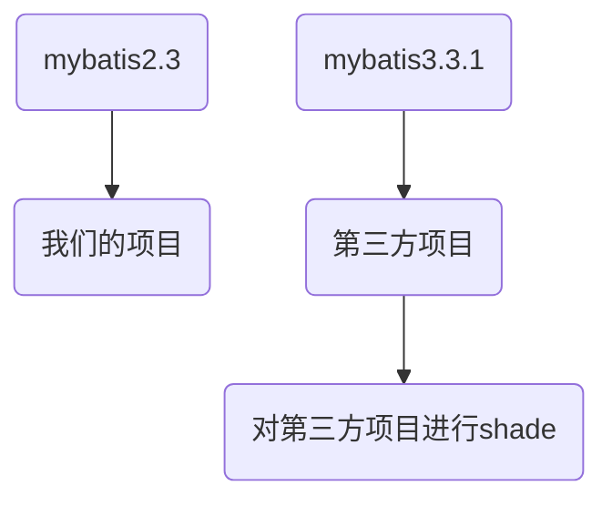
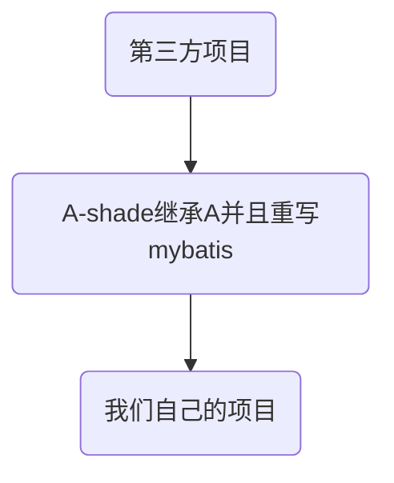

目前有一个项目，A是第三方应用，代码不公开，不能修改，使用的是mybatis plugs3.3.1，而当前项目是我们自己的B，它需要用到A里的方法，B里mybatis plugs版本是2.3，目前在使用过程中出现了问题，这两个版本的有些方法，注解都发生了很大的变化 ：
> mybatis 3.x  BaseMapper注解的位置：import com.baomidou.mybatisplus.core.mapper.BaseMapper;
> mybatis 2.x  BaseMapper注解的位置：import com.baomidou.mybatisplus.mapper.BaseMapper;
这两个版本对于很多注解，接口，方法，类都是不同的，两个版本无法兼容，当我们项目引用A项目之后，就出现A版本里使用mybatis的一些错误，就是方法，类未找到的错误。

# shade插件进行解决
我们需要引用a-shade这个项目，它来依赖a，然后在它里使用shade插件对a里的mybatis进行重命名，再由b直接引用a-shade，这时 a里的方法也就有了，并且引用了mybatis的地方都换成了shade开头的包了

# 实现图

# a-shade.jar反编译之后


# a-shade项目的shade代码
```
   <artifactId>a-service-shade</artifactId>
    <dependencies>
        <dependency>
            <groupId>com.lind</groupId>
            <artifactId>a-service</artifactId>
            <version>1.0.0</version>
        </dependency>
    </dependencies>

    <build>
        <plugins>
            <plugin>
                <groupId>org.apache.maven.plugins</groupId>
                <artifactId>maven-shade-plugin</artifactId>
                <version>3.2.1</version>

                <executions>
                    <execution>
                        <phase>package</phase>
                        <goals>
                            <goal>shade</goal>
                        </goals>
                        <configuration>
                            <!-- 不生成dependency-reduced-pom.xml-->
                            <createDependencyReducedPom>false</createDependencyReducedPom>
                            <relocations>
                                <relocation>
                                    <pattern>com.baomidou</pattern>
                                    <shadedPattern>shade.com.baomidou</shadedPattern>
                                </relocation>
                            </relocations>
                        </configuration>
                    </execution>
                </executions>
            </plugin>
        </plugins>
    </build>

```
# 引用a-shade 
打包发布后，B项目直接使用a-shade这个包即可，其它代码不需要修改
```
 <dependency>
    <groupId>com.lind</groupId>
     <artifactId>a-shade</artifactId>
     <version>1.0.1</version>
 </dependency>
```
