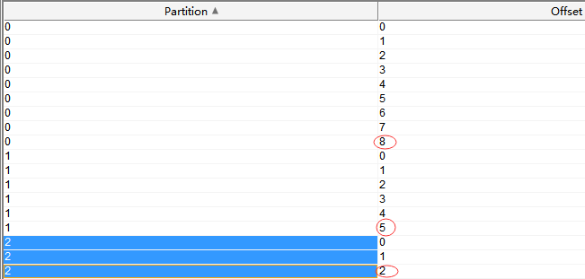
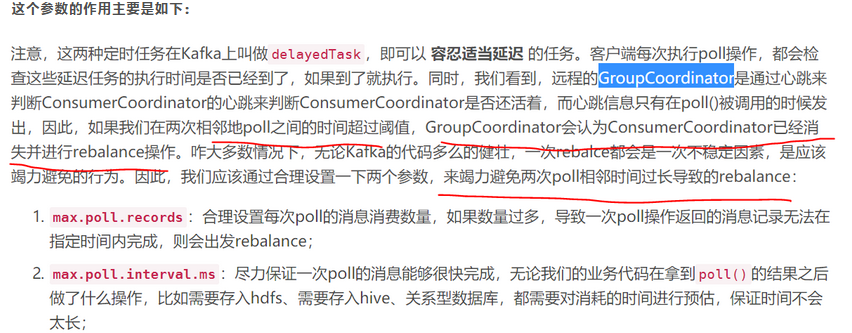

# 组件说明
* 对生产者producer封装，统一发送消息
* 添加aop模块，对发消息时进行拦截，对公用字段统一赋值 
* 添加当前用户接口`CurrentUserAware`，由使用者去实现它
* 去掉了kafka-receiver包，感觉封装意义不大
* 使用时先添加注解`@EnableMqKafka`
# docker简单部署
```js
# zk
docker run -d --cpus 0.5 -m 200M   --restart always  -u root  --name zookeeper  -p 2181:2181  -p 2888:2888  -p 3888:3888  zookeeper:3.5.7
# kafka
docker run --cpus 1 -d -m 1g --restart always --name kafka-2.5.0 -p 9092:9092 --link zookeeper -e KAFKA_HEAP_OPTS="-Xmx2g -Xms2g" -e KAFKA_ZOOKEEPER_CONNECT=192.168.1.6:2181 -e KAFKA_ADVERTISED_HOST_NAME=192.168.1.6 -e KAFKA_ADVERTISED_PORT=9092 -e KAFKA_LOG_RETENTION_BYTES=10737418240 -e KAFKA_LOG_RETENTION_HOURS=24 -e KAFKA_DELETE_TOPIC_ENABLE=true -e KAFKA_OFFSETS_TOPIC_REPLICATION_FACTOR=1 -e KAFKA_LOG_DIRS="/kafka/kafka-logs-2.5.0" wurstmeister/kafka:2.12-2.5.0
```
# 带有目录挂载的docker部署
```js
#zookeeper采用官方版本：3.5.7
docker run -d --cpus 0.5 -m 200M \
--restart always \
-u root \
--name zookeeper \
-p 2181:2181 \
-p 2888:2888 \
-p 3888:3888 \
-v /etc/localtime:/etc/localtime \
-v /mnt/zookeeper-3.5.7/data:/data \
-v /mnt/zookeeper-3.5.7/log:/datalog \
-v /mnt/zookeeper-3.5.7/conf:/conf \
zookeeper:3.5.7

#kafka则使用github使用率较高的wurstmeister/kafka,相对简单，更新到位
docker run --cpus 4 -d -m 4g \
--restart always \
--name kafka-2.5.0 \
-p 9092:9092 \
--link zookeeper \
-e KAFKA_HEAP_OPTS="-Xmx2g -Xms2g" \
-e KAFKA_ZOOKEEPER_CONNECT=172.19.**.**:2181 \
-e KAFKA_ADVERTISED_HOST_NAME=47.100.***.*** \
-e KAFKA_ADVERTISED_PORT=9092 \
-e KAFKA_LOG_RETENTION_BYTES=10737418240 \
-e KAFKA_LOG_RETENTION_HOURS=24 \
-e KAFKA_DELETE_TOPIC_ENABLE=true \
-e KAFKA_OFFSETS_TOPIC_REPLICATION_FACTOR=1 \
-e KAFKA_LOG_DIRS="/kafka/kafka-logs-2.5.0"
-v /etc/localtime:/etc/localtime \
-v /mnt/kafka-2.5.0:/kafka \
-v /var/run/docker.sock:/var/run/docker.sock \
wurstmeister/kafka:2.12-2.5.0
```
# docker-compose版本
```yml
version: '2'
services:
  zookeeper:
    image: wurstmeister/zookeeper
    hostname: zookeeper1
    network_mode: bridge
    ports:
      - "2181:2181"
  kafka:
    image: wurstmeister/kafka:2.11-0.11.0.3
    hostname: kafka1
    network_mode: bridge
    links:
      - zookeeper
    ports:
      - "9092:9092" #表示宿主机的端口为随机，这样方便使用docker-compose scale 进行扩容
    environment:
      KAFKA_ADVERTISED_LISTENERS: PLAINTEXT://:9092
      KAFKA_LISTENERS: PLAINTEXT://:9092
      KAFKA_ZOOKEEPER_CONNECT: zookeeper:2181
```
# spring代理
* 对接口进行代理，不能有实现类，主要效仿在mybatis的实现
* 一般代理一个基接口，然后由不同的泛型子接口去继承它，从而代码这些子接口，完成统一的处理
# 代理的注册
* 使用springboot提供的注解直接注册
* 实现spring的ImportBeanDefinitionRegistrar,FactoryBean等接口完成注册
# 默认实现与附加行为
* 添加接口默认实现类
* 添加附加接口类，一般理解为回调方法的接口，或者函数式接口
* 使用者直接自定自己的接口，但需要声明`@MessageProvider`和`@MessageSend`注解，以便让代理可以找到你

# 分区partition
1. 每个partition有自己的offset
2. 单个partition里的消息是有序的
3. 多个partition对于同组的不同消费者来说，是并行的，非阻塞的


# 重复消费

1. 消费任务执行时间长
2. max.poll.interval.ms设置太小，比任务执行时间还小
3. 当出现了上面情况时，由于任务执行时间长，在任务没有被commit之前，消费者又进行了poll操作，导致了重复消费
 > 一般情况下，kafka重复消费都是由于未正常提交offset，故修改配置，正常提交offset即可解决。上文中提到的主要配置如下所示：
```
/* 自动确认offset的时间间隔  */
props.put("auto.commit.interval.ms", "1000");
 
props.put("session.timeout.ms", "30000");
 
//消息发送的最长等待时间.需大于session.timeout.ms这个时间
props.put("request.timeout.ms", "40000");
 
//一次从kafka中poll出来的数据条数
//max.poll.records条数据需要在在session.timeout.ms这个时间内处理完
props.put("max.poll.records","100");

//两个poll的时间间隔
props.put("max.poll.interval.ms",1000);
//server发送到消费端的最小数据，若是不满足这个数值则会等待直到满足指定大小。默认为1表示立即接收。
props.put("fetch.min.bytes", "1");
//若是不满足fetch.min.bytes时，等待消费端请求的最长等待时间
props.put("fetch.wait.max.ms", "1000");
```